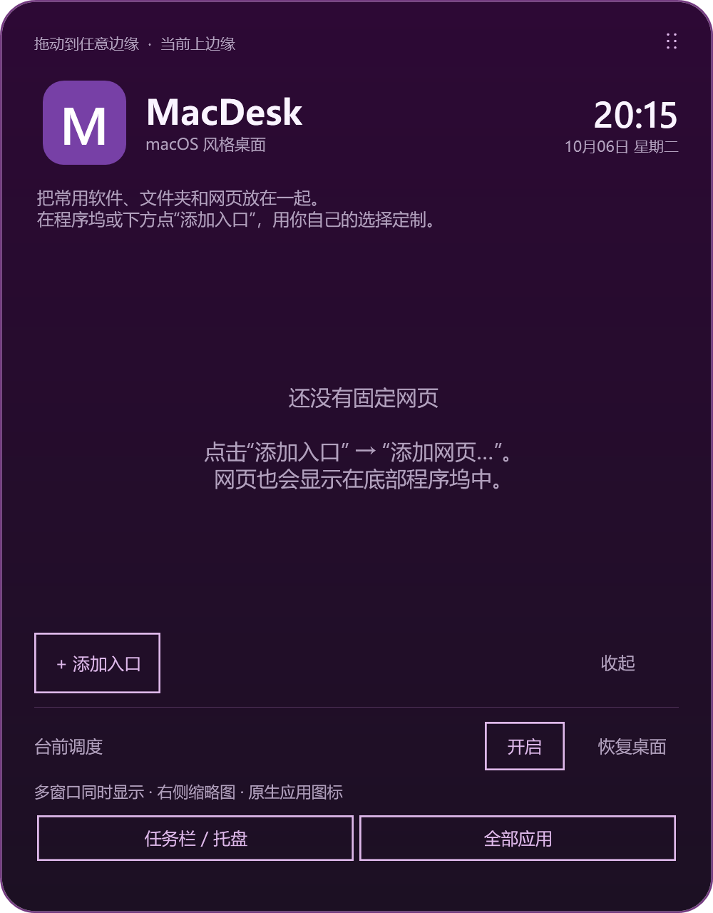

# MacDesk

A portable Windows desktop companion with a bottom Dock, a live window sidebar,
and an edge-triggered shortcut center. 中文说明见下方。

MacDesk combines a modified [StageManagerForWindows](https://github.com/depoledna/StageManagerForWindows)
with a separate WPF Dock. It is an independent community project, inspired by
macOS desktop interactions, with no affiliation with Apple or Microsoft.

**Preview release.** The source builds and its owned-window/policy fixtures are
checked. Real desktop testing has so far been limited to one Windows computer;
different Windows versions, app builds, multiple displays, and virtual-desktop
transitions still need broader testing.



## 功能

- 底部程序坞：原生应用图标、悬停放大、运行标记和右键窗口选择。
- 可添加软件、快捷方式、文件夹和网页；使用“添加入口”按钮，右键调整顺序或移除。
- 右边缘悬停展开实时缩略图侧栏；点击或拖出恢复窗口，滚轮或双指上下滑动浏览。
- 默认允许多个应用及同一应用的多个窗口同时显示，不要求手动命名任务分组。
- 上边缘快捷中心：时间、常用网页按钮、程序坞和任务栏入口。隐藏后不保留小框。
- 运行期间临时隐藏系统任务栏；“任务栏 / 托盘”按钮点一次显示，再点一次收起。
- 微信、QQ 后台恢复使用现有系统托盘入口，避免重新打开登录进程。兼容性取决于应用与 Windows 的托盘实现；恢复失败时提供手动托盘入口。
- 全屏时让出屏幕；正常退出时恢复任务栏和已收起的窗口。程序坞的普通权限守护程序可处理意外退出。

公开版使用通用紫色界面，无个人头像、主页、校园默认链接、校徽或邮箱连接。
网页按钮来自使用者自己添加的网页入口，个人信息不会作为默认配置发布。

## 使用

在本仓库 **Releases** 下载 `MacDesk-windows-x64.zip`，解压到你有写入权限的文件夹。
保持整个文件夹结构完整，然后双击 `MacDesk.exe`。不要只复制其中一个可执行文件。
首版面向 Windows 10 / 11 x64；Stage 运行时随包提供，Dock 使用 Windows 自带的
.NET Framework 4.x。其他架构暂未提供安装包。

| 操作 | 入口 |
| --- | --- |
| 正常启动 | 双击 `MacDesk.exe` |
| 启动选项 | 运行 `MacDesk.exe /help` |
| 管理高权限应用 | 运行 `MacDesk.exe /admin`，自行确认 Windows 授权 |
| 退出并恢复桌面 | 运行 `MacDesk.exe /stop`，或托盘菜单退出 |
| 紧急恢复系统任务栏 | `Ctrl + Alt + Shift + F11` |
| 退出台前调度并恢复桌面 | `Ctrl + Alt + Shift + F12` |
| 显示桌面 / 返回任务 | `Ctrl + Alt + Shift + D` |

默认启动使用普通权限。Legion 等高权限窗口可能需要管理员模式才能恢复；管理员模式
请先退出已运行的普通实例，再选择管理员启动。它只提升本次 Stage 进程，程序坞仍保持普通权限。
没有静默提权、系统服务、注册表导入或自动开机注册。
Windows 的任务视图仍可使用，系统手势与应用版本之间的兼容性欢迎报告。

## 配置与退出

配置、应用入口和临时状态保存在解压目录的 `NativeDock` / `CampusStage` 中。
更新时先退出，把旧的个人配置另行备份，然后使用完整的新发布包。
本项目不自动下载或覆盖上游可执行文件。停止后可删除解压目录来移除程序；自行创建的快捷方式也可直接删除。

不要把日常使用后的目录直接提交到 GitHub。窗口恢复、应用入口和诊断记录可能含有
本机应用路径或窗口元数据。详见 [隐私说明](docs/PRIVACY.md)。

## 从源码构建

需要 Windows x64、.NET 10.0.401 SDK，以及系统 .NET Framework 4.x 编译器。
构建会核对捆绑的运行时为 10.0.12，与随包许可证一致。
在 PowerShell 中运行：

```powershell
./scripts/Build.ps1
```

输出位于 `artifacts/MacDesk-windows-x64.zip` 和对应 `.sha256` 文件。
脚本会构建 Stage、Dock、启动器，并运行八项 Dock 检查和 Stage 自检。
这些检查使用策略数据和测试自有窗口，不以控制已打开的桌面应用来验证。

可通过 `-DotnetPath` 指定 SDK，通过 `-ArtifactsPath` 更换输出目录；离线构建可用
`-NugetSource` 指向自己的完整 NuGet 源。构建不读取已安装程序的个人配置。

```text
src/StageManager/       window tracking, sidebar, native recovery and taskbar guard
src/Dock/               Dock, generic quick center, pins and tray recovery
src/Launcher/           portable normal/admin/stop entry point
scripts/               reproducible build and fixture checks
third_party/libuiohook/ matching LGPL native dependency source
licenses/              redistribution license texts
```

原生 `uiohook.dll` 保持独立可替换；对应源码与许可证随发布包提供。发布前请保留
[第三方声明](THIRD_PARTY_NOTICES.md)，不要将该原生库嵌入不可替换的单文件。

## 已知限制与反馈

- 项目仍是预览版；不同聊天软件的托盘恢复可能有差异。应用关闭或退出登录后，程序坞不会替你恢复登录会话。
- 同一桌面同时运行多套任务栏或窗口管理工具可能相互影响。仅运行一套 MacDesk。
- 多显示器、虚拟桌面和全屏处理有实现与自检，但尚未完成广泛真实环境验证。
- 不提供邮件提醒、云同步、远程控制或遥测上传；个人版的邮箱连接不包含在公开发行版。

提交问题时请给出 Windows 版本、应用名称和版本、启动权限、复现步骤及预期效果。
不要上传密码、邮箱配置、完整窗口列表、未脱敏截图或日常运行目录。

## Attribution and license

The Stage component derives from [Andreas Wäscher's StageManager](https://github.com/awaescher/StageManager)
and [StageManagerForWindows](https://github.com/depoledna/StageManagerForWindows).
Window-tracking code includes material derived from [workspacer](https://github.com/rickbutton/workspacer).
Original copyright notices are retained. Project code is MIT; third-party native
libraries retain their respective licenses. See [LICENSE](LICENSE) and
[THIRD_PARTY_NOTICES.md](THIRD_PARTY_NOTICES.md).

## English quick start

Download and extract the complete x64 release, then open `MacDesk.exe`.
Hover at the right edge for live window thumbnails and at the top edge for the
shortcut center. Add apps and URLs from the Dock; right-click entries to manage
them. Multiple applications can stay visible together by default.

The taskbar is temporarily hidden while Stage is active. The taskbar/tray button
toggles it; `/stop` requests a graceful shutdown and restoration. `/admin` is an
explicit option for elevated target apps and requires the user's UAC approval.
No registry, service, or automatic startup registration is installed. Build from
source with `./scripts/Build.ps1` on Windows with .NET 10 SDK.
